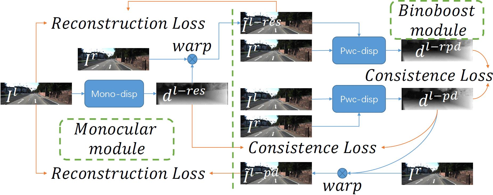
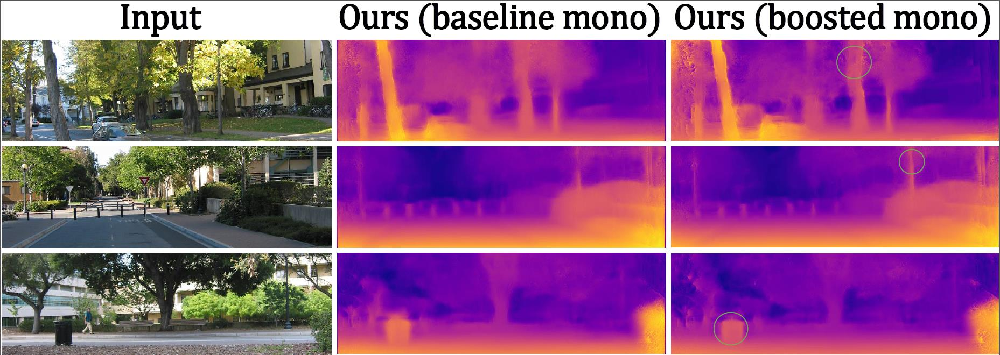
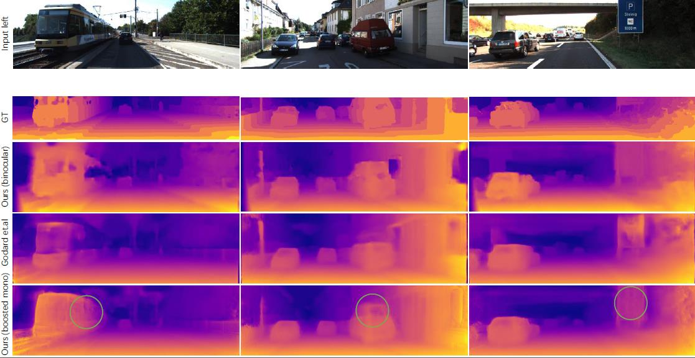

# BINOBOOST
This project is for our ICIP2019 paper "BINOBOOST: BOOSTING SELF-SUPERVISED MONOCULAR DEPTH PREDICTION WITH BINOCULAR GUIDANCE"

## Network

## Result
We provide our results of benchmark datasets used in the paper for convenience.

### make3D

### CityScape

